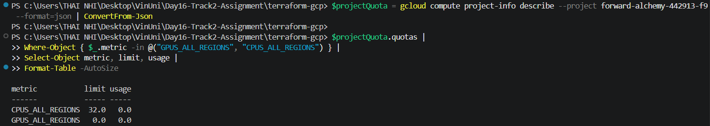
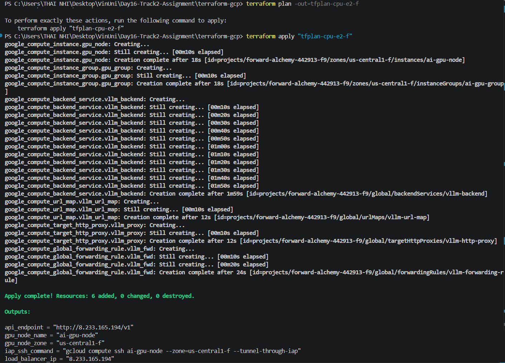
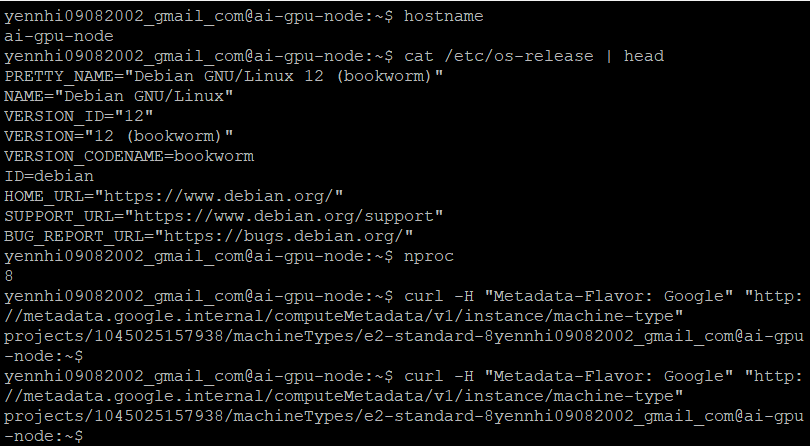
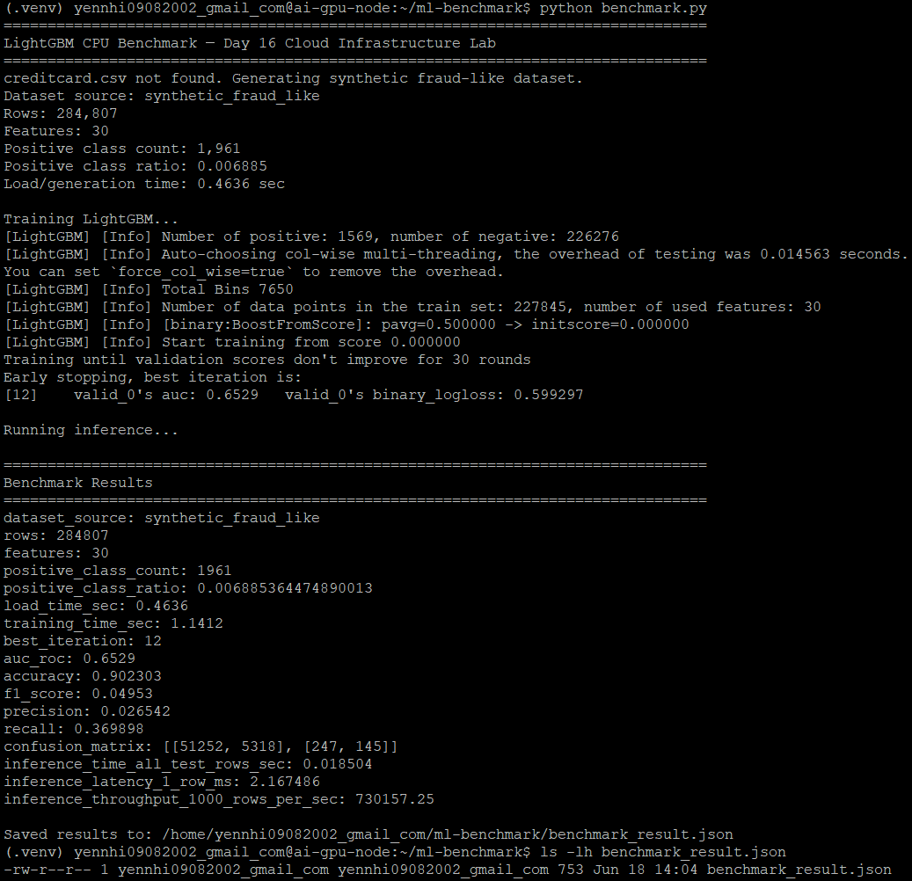
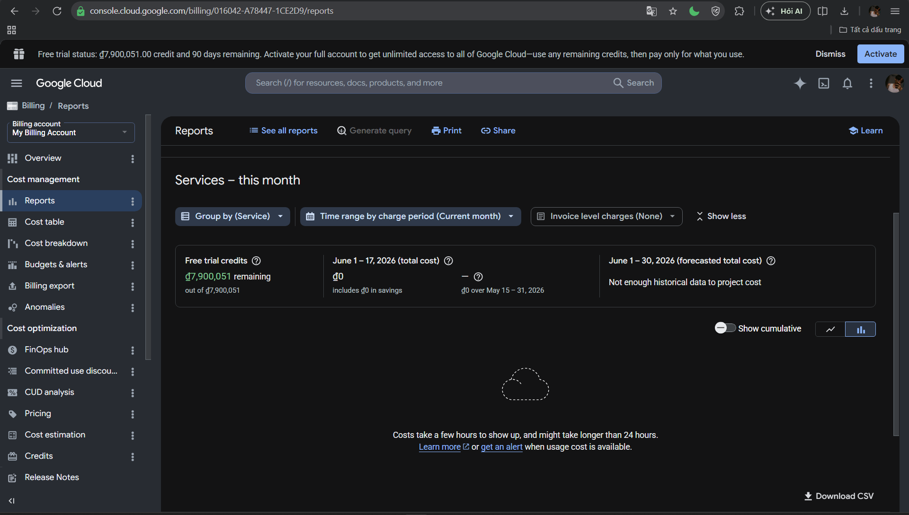
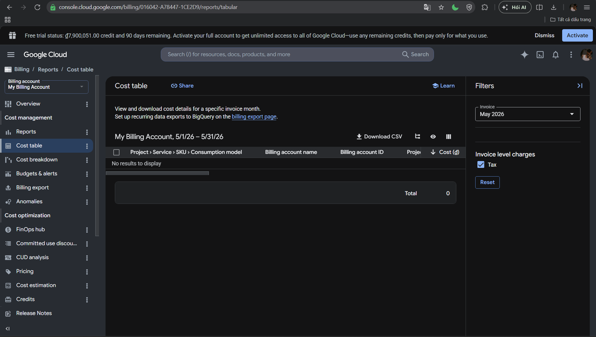
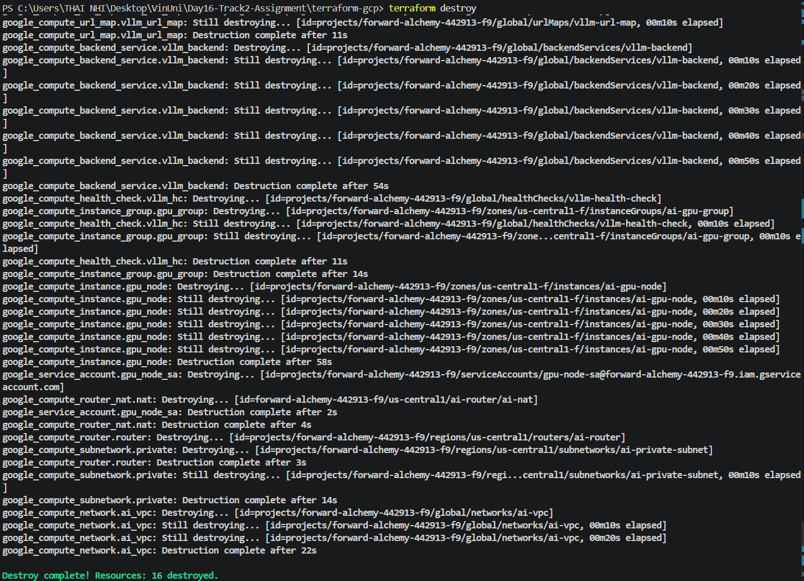

# Day 16 - Track 2 Assignment

## Cloud Infrastructure for AI - CPU Fallback Deployment

Repo này là bài lab Day 16 cho chủ đề **Cloud Infrastructure for AI**. Mục tiêu ban đầu là triển khai một **AI serving environment** trên Google Cloud bằng **Terraform Infrastructure as Code**, sử dụng GPU VM để chạy inference endpoint. Tuy nhiên, trong quá trình thực hiện, GCP project không có đủ **global GPU quota**, nên bài lab được hoàn thành theo hướng **CPU fallback** với VM `e2-standard-8` và benchmark bằng **LightGBM**.

---

## 1. Tóm tắt kết quả

| Hạng mục | Kết quả |
|---|---|
| Cloud provider | Google Cloud Platform |
| Deployment method | Terraform IaC |
| Project ID | `forward-alchemy-442913-f9` |
| Region | `us-central1` |
| Zone | `us-central1-f` |
| Instance name | `ai-gpu-node` |
| Final machine type | `e2-standard-8` |
| Operating system | Debian GNU/Linux 12 |
| CPU | 8 vCPU |
| GPU | Không dùng do `GPUS_ALL_REGIONS = 0.0` |
| Workload | LightGBM CPU benchmark |
| Dataset | Synthetic fraud-like dataset |
| Cleanup | `terraform destroy` completed |

---

## 2. Evidence nhanh

| Evidence | File |
|---|---|
| GPU quota = 0, lý do dùng CPU fallback | [00_gpu_quota_zero_reason_for_cpu_fallback.png](screenshots/00_gpu_quota_zero_reason_for_cpu_fallback.png) |
| Terraform apply thành công | [01_terraform_apply_success.png](screenshots/01_terraform_apply_success.png) |
| Kiểm tra VM `e2-standard-8` | [02_vm_machine_check_e2_standard_8.png](screenshots/02_vm_machine_check_e2_standard_8.png) |
| LightGBM benchmark result | [03_lightgbm_benchmark_result.png](screenshots/03_lightgbm_benchmark_result.png) |
| Billing Reports initial screenshot | [04_billing_report_initial_0vnd_delay.png](screenshots/04_billing_report_initial_0vnd_delay.png) |
| Billing Cost Table initial screenshot | [05_billing_cost_table_initial_0vnd.png](screenshots/05_billing_cost_table_initial_0vnd.png) |
| Terraform destroy completed | [06_terraform_destroy_complete.png](screenshots/06_terraform_destroy_complete.png) |
| Benchmark source code | [benchmark.py](evidence/benchmark.py) |
| Benchmark result JSON | [benchmark_result.json](evidence/benchmark_result.json) |

---

## 3. Lý do chuyển sang CPU fallback

Lab gốc yêu cầu GPU VM. Tuy nhiên, project GCP tại thời điểm thực hiện có **global GPU quota** bằng 0.

Quota kiểm tra được:

| Metric | Limit | Usage |
|---|---:|---:|
| `CPUS_ALL_REGIONS` | 32.0 | 0.0 |
| `GPUS_ALL_REGIONS` | 0.0 | 0.0 |

Vì `GPUS_ALL_REGIONS = 0.0`, GPU VM không thể được tạo thành công. Do đó, bài lab được chuyển sang hướng **CPU fallback** để vẫn đảm bảo đầy đủ workflow chính:

**Terraform IaC → Cloud VM → ML workload → Benchmark metrics → Billing evidence → Cleanup**

Screenshot quota:

---

## 4. Infrastructure được tạo bằng Terraform

Terraform đã tạo các cloud resources sau:

| Resource group | Resource |
|---|---|
| Network | Custom VPC `ai-vpc` |
| Subnet | Private subnet `ai-private-subnet` |
| NAT | Cloud Router `ai-router`, Cloud NAT `ai-nat` |
| Security | Firewall rule for IAP SSH, firewall rule for Load Balancer health check |
| IAM | Service Account for compute node |
| Compute | VM instance `ai-gpu-node` |
| Load balancing | Instance group, backend service, URL map, HTTP proxy, global forwarding rule |

Terraform apply result:

| Output | Value |
|---|---|
| `api_endpoint` | `http://8.233.165.194/v1` |
| `gpu_node_name` | `ai-gpu-node` |
| `gpu_node_zone` | `us-central1-f` |
| `iap_ssh_command` | `gcloud compute ssh ai-gpu-node --zone=us-central1-f --tunnel-through-iap` |
| `load_balancer_ip` | `8.233.165.194` |

Evidence:

Log output file:

- [terraform_outputs.txt](evidence/terraform_outputs.txt)
- [gcp_instances.txt](evidence/gcp_instances.txt)
- [gcp_forwarding_rules.txt](evidence/gcp_forwarding_rules.txt)

---

## 5. VM verification

VM được truy cập thông qua **Google Cloud IAP SSH**.

Các kiểm tra đã thực hiện:

| Check | Result |
|---|---|
| Hostname | `ai-gpu-node` |
| OS | Debian GNU/Linux 12 |
| CPU cores | 8 |
| Machine type | `e2-standard-8` |

Evidence:

---

## 6. ML benchmark

Vì không có GPU quota, workload được chuyển sang **LightGBM CPU benchmark**. Benchmark mô phỏng bài toán **fraud detection** bằng synthetic fraud-like dataset.

Source code:

- [evidence/benchmark.py](evidence/benchmark.py)

Benchmark result JSON:

- [evidence/benchmark_result.json](evidence/benchmark_result.json)

Dataset summary:

| Item | Value |
|---|---:|
| Dataset source | `synthetic_fraud_like` |
| Rows | 284,807 |
| Features | 30 |
| Positive class count | 1,961 |
| Positive class ratio | 0.006885 |

Benchmark results:

| Metric | Value |
|---|---:|
| Load/generation time | 0.4636 sec |
| Training time | 1.1412 sec |
| Best iteration | 12 |
| AUC-ROC | 0.6529 |
| Accuracy | 0.902303 |
| F1-score | 0.04953 |
| Precision | 0.026542 |
| Recall | 0.369898 |
| Inference latency - 1 row | 2.167486 ms |
| Inference throughput - 1000 rows | 730157.25 rows/sec |

Evidence:

---

## 7. Billing evidence

Billing Reports và Cost Table đã được kiểm tra ngay sau khi hoàn thành lab.

Tại thời điểm chụp screenshot, Google Cloud Billing hiển thị chi phí hiện tại là `0 VND`. Trang Billing cũng có thông báo rằng cost có thể mất vài giờ hoặc hơn 24 giờ để cập nhật.

Billing screenshots:

Ghi chú:

Billing được kiểm tra ngay sau khi lab hoàn thành. Google Cloud hiển thị current cost là `0 VND` và thông báo rằng cost có thể mất vài giờ hoặc hơn 24 giờ để xuất hiện trong report. Vì vậy, screenshot billing hiện tại được dùng làm evidence cho bước kiểm tra Billing Reports/Cost Table.

Estimated active cost drivers trong thời gian lab chạy:

- `e2-standard-8` Compute Engine VM
- 100GB persistent boot disk
- Cloud NAT
- External HTTP Load Balancer
- Global forwarding rule

---

## 8. Cleanup

Sau khi thu thập evidence, toàn bộ cloud resources đã được xóa bằng Terraform để tránh phát sinh chi phí.

Cleanup command:

`terraform destroy`

Kết quả:

`Destroy complete! Resources: 16 destroyed.`

Sau cleanup, VM list trả về:

`Listed 0 items.`

Evidence:

Cleanup files:

- [after_destroy_instances.txt](evidence/after_destroy_instances.txt)
- [after_destroy_forwarding_rules.txt](evidence/after_destroy_forwarding_rules.txt)
- [terraform_state_after_destroy.txt](evidence/terraform_state_after_destroy.txt)

---

## 9. Repository structure

| Path | Mô tả |
|---|---|
| [README.md](README.md) | Report chính của bài lab |
| [.gitignore](.gitignore) | Loại bỏ Terraform state, local plan, secrets, cache |
| [terraform-gcp/main.tf](terraform-gcp/main.tf) | Terraform resources chính cho GCP |
| [terraform-gcp/variables.tf](terraform-gcp/variables.tf) | Terraform variables |
| [terraform-gcp/providers.tf](terraform-gcp/providers.tf) | Google provider config |
| [terraform-gcp/outputs.tf](terraform-gcp/outputs.tf) | Terraform outputs |
| [terraform-gcp/user_data.sh](terraform-gcp/user_data.sh) | Startup script gốc của repo |
| [evidence/benchmark.py](evidence/benchmark.py) | LightGBM benchmark script |
| [evidence/benchmark_result.json](evidence/benchmark_result.json) | Benchmark metrics |
| [screenshots/](screenshots/) | Toàn bộ screenshot evidence |

---

## 10. Lưu ý quan trọng

- Terraform state files, local plan files, `.terraform/`, secrets và backup files đã được loại bỏ bằng `.gitignore`.
- GPU path không được dùng vì `GPUS_ALL_REGIONS = 0.0`.
- CPU fallback vẫn thể hiện đầy đủ workflow của lab: Infrastructure as Code, cloud VM, ML workload, benchmark, billing check và cleanup.
- Tất cả cloud resources đã được destroy sau lab.
- Billing cost có thể cập nhật trễ vì Google Cloud cost reporting không phải real-time.

---

## 11. Final checklist

| Requirement | Status |
|---|---|
| GPU quota evidence | Done |
| Terraform apply evidence | Done |
| VM verification evidence | Done |
| ML benchmark evidence | Done |
| `benchmark.py` | Done |
| `benchmark_result.json` | Done |
| Billing Reports screenshot | Done |
| Cost Table screenshot | Done |
| Terraform destroy screenshot | Done |
| Terraform source files | Done |
| Cleanup evidence logs | Done |

---

## 12. Kết luận

Bài lab đã hoàn thành theo hướng **CPU fallback** do project không có global GPU quota. Hạ tầng cloud được provision bằng **Terraform**, VM được xác thực qua **IAP SSH**, workload ML được benchmark bằng **LightGBM**, billing page đã được kiểm tra, và toàn bộ resources đã được cleanup bằng `terraform destroy`.
